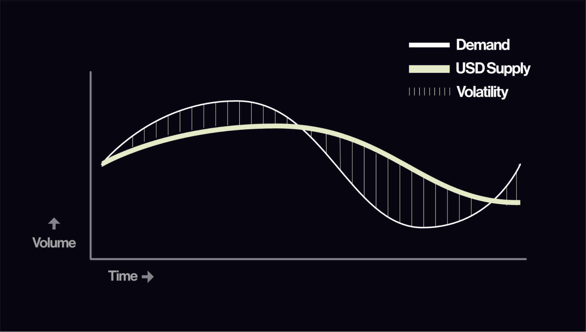
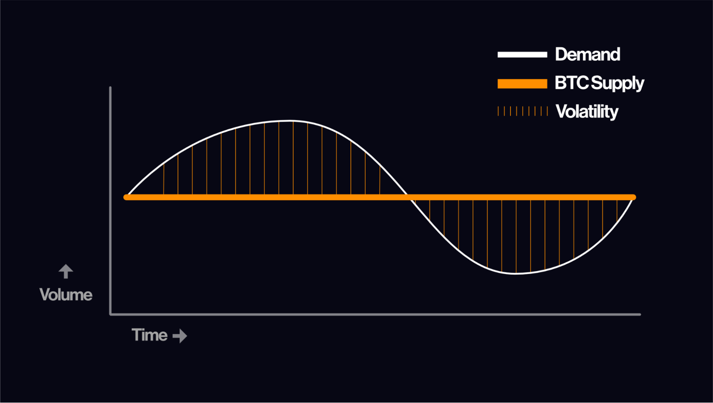
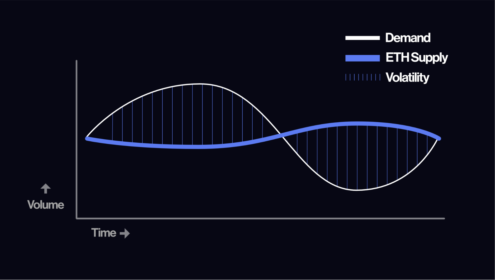
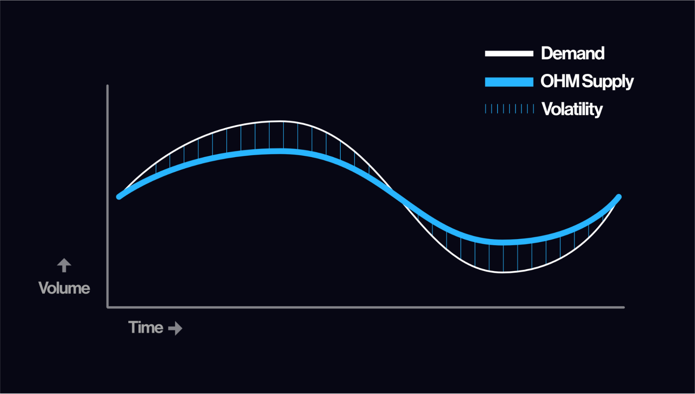

# What is Olympus Protocol?

Olympus is a protocol on the Ethereum blockchain with the goal of establishing OHM as a crypto-native reserve currency. It conducts autonomous and dynamic monetary policy, with market operations supported by the protocol-owned Olympus Treasury.

OHM serves a need in the market gap between fiat stablecoins and volatile crypto assets, providing relative stability and scalability underpinned by the protocol’s Range Bound Stability (“RBS”) system. RBS is the flagship system of Olympus’ autonomous monetary policy.

### What are reserve currencies designed to achieve?

* Deep liquidity: reserve currencies are highly liquid and can be easily exchanged for other assets, products and services
* Serve as a unit of account: Other assets are denominated in the currency
* Preserve purchasing power: Provides its holders a stable, low volatility asset that grows at a steady rate over the medium-to- long-term.

Olympus DAO’s efforts in Treasury management, development of on-chain governance structures and prudent use of Olympus’ liquidity and Treasury assets will help to strengthen OHM’s stability to usher in the growth of the Olympus network economy.

### Why do we need OHM now? 

OlympusDAO's primary goal is to establish OHM as the premier reserve currency within the cryptocurrency market. To achieve this goal, OHM must serve as a medium of exchange. In order for a medium of exchange to be effective, it must maintain long-term stability, which is accomplished by reducing the discrepancy between supply and demand. This discrepancy can be addressed through the implementation of a monetary policy.

Take, for instance, the Federal Reserve's role in determining the monetary policy for the US Dollar, which is largely backed by a stable democracy and abundant military. This policy is implemented by altering the availability of the currency through market interventions, such as increasing the interest rate. Nevertheless, due to its reliance on lagging indicators, the monetary policy may be implemented at an inopportune time, resulting in heightened volatility.\

<figure><figcaption>
This is an oversimplification and should be considered for illustrative purposes only.
</figcaption></figure>

In the cryptocurrency market, stablecoins have been utilized to fill the void of a reliable medium of exchange. This is due to the fact that the monetary policy of both Bitcoin (BTC) and Ethereum (ETH) is not well-suited for this purpose.&#x20;

BTC, for instance, has a fixed total supply that remains relatively constant over time, leading to a discrepancy between supply and demand, which often results in high levels of volatility.

<figure><figcaption>
This is an oversimplification and should be considered for illustrative purposes only.
</figcaption></figure>

In contrast, the supply of Ethereum (ETH) decreases as demand increases, making it too volatile for an ideal medium of exchange.

<figure><figcaption>
This is an oversimplification and should be considered for illustrative purposes only.
</figcaption></figure>

The cryptocurrency market offers numerous options for storing value, but it lacks a low-volatility medium of exchange that aligns with the ideological principles of the industry while having an elastic supply like the US dollar.&#x20;

To address this gap, OlympusDAO has developed OHM, a cryptocurrency that aims to close the discrepancy between supply and demand through the utilization of an automated version of monetary policy.&#x20;

This policy is powered by real-time on-chain data and is referred to as Range-Bound Stability (RBS). To learn more about RBS, please refer to our documentation.

<figure><figcaption>
This is an oversimplification and should be considered for illustrative purposes only.
</figcaption></figure>
