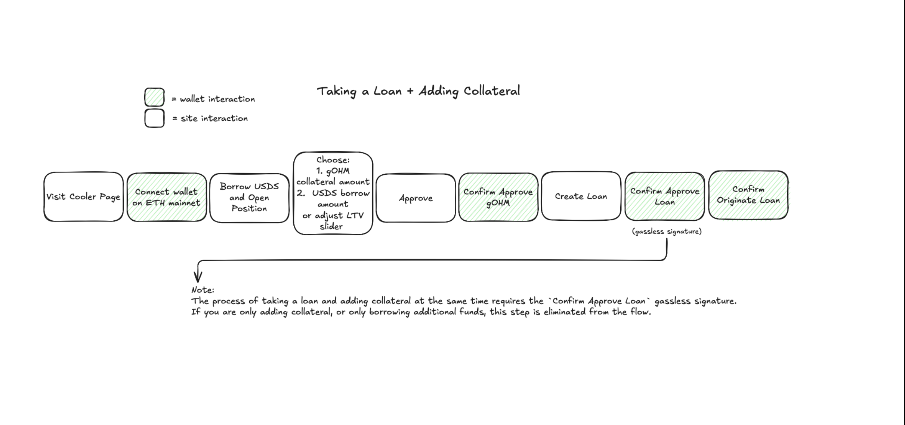
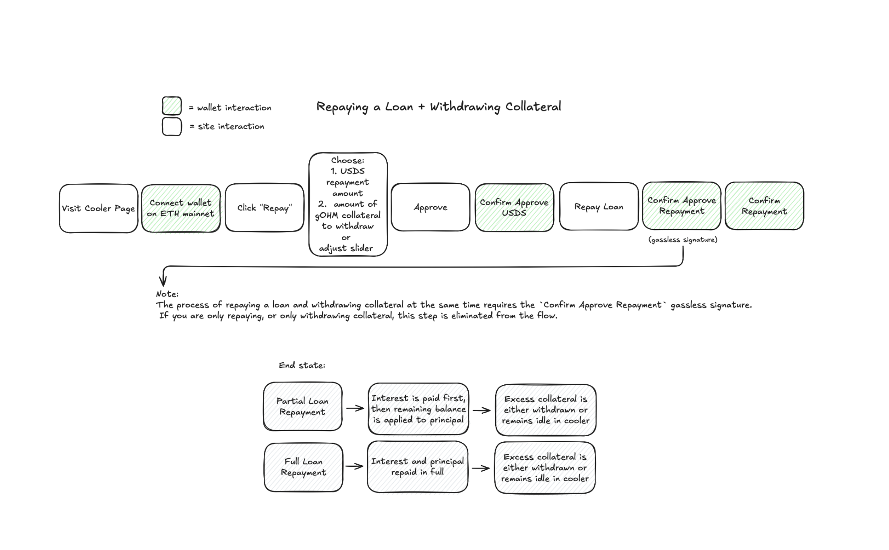
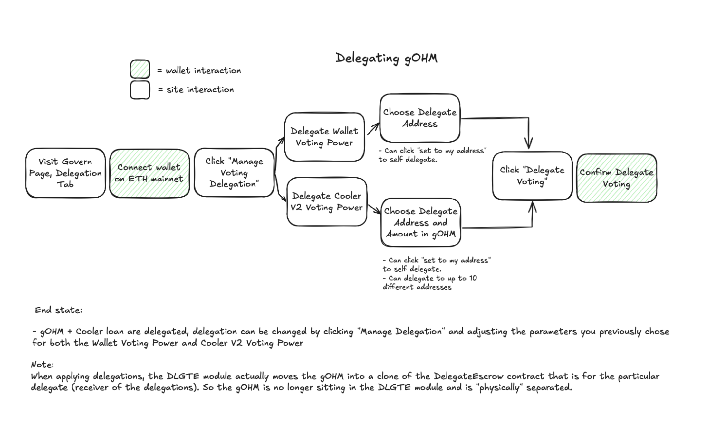

# Cooler Loans

## Overview

Cooler Loans is Olympus DAO's protocol-native, perpetual lending system that allows OHM (Olympus) token holders to borrow USDS by using their gOHM (governance OHM) tokens as collateral. This lending facility is permissionless, immutable, and governed by Olympus smart contracts. With Cooler Loans, users will have a reliable access to liquidity using their gOHM token as collateral. Cooler V2 introduces a fixed-rate borrowing model backed directly by the Olympus Treasury, with no price-based liquidations and no expiry. V2 evolves beyond V1’s fixed term-based model, offering a more flexible credit primitive for long-term gOHM holders and treasuries.

Cooler Loans differentiates itself from existing lending markets:

- **Peer-to-lender** - loans originate from Olympus Treasury. Practically, Cooler Loans acts as lender-of-last-resort and can guarantee liquidity because every gOHM is backed by USDS.
- **Perpetual Borrowing** - No expiration or renewal needed. Positions stay open as long as interest is paid.
- **Fixed 0.5% APR** - Continuous interest accrual, set via governance, independent of market conditions.
- **No Price-Based Liquidations** - Whereas most lending markets will liquidate your position if underlying collateral falls below a certain price, Cooler Loans is in a unique position to offer liquidation-free loans because every gOHM is backed by USDS. As long as Loan-to-Collateral value is at a safe discount relative to actual backing, the protocol remains solvent. Loans default only when unpaid interest exceeds a governance-defined threshold.
- **Unified Loan Position** - One dynamic loan per user- collateral, debt, and repayments are managed flexibly.
- **Governance-Aligned LTV Drip** - Origination LTV increases over time through a governance-controlled drip system.
- **gOHM Collateral** - Ensures borrowing is backed by a protocol-native asset, reinforcing system solvency.
- **Delegated Voting Power** - Users can delegate voting power from Cooler collateral to up to 10 delegate addresses.
- **No External Price Oracle, Fully Treasury-Backed** - Since Cooler Loans does not have price-based liquidations and origination is based on governance-defined LTVs, it does not depend on external price oracles or price feeds.
- **Manual Leverage Flexibility** - Users can re-leverage at their discretion by adding collateral and borrowing more, enabling custom exposure timing and pricing based on market premiums.
- **No Exit Fees** - There are no penalties or fees for full or partial repayment of loans.
- **Reduced Contract Risk** - Cooler V2 is a minimal, single-purpose system, reducing attack surface and simplifying security assumptions.
- **Predictable Terms** - Capacity, Loan-to-backing amount, drip rate, and interest rates are all established parameters determined by governance.

## Architecture

Cooler V2 is composed of policy, module, and periphery contracts. The primary borrowing flow uses MonoCooler directly; V1 migration periphery is no longer part of the supported user flow.

| Layer     | Contract                                                  | Purpose                                                              |
| --------- | --------------------------------------------------------- | -------------------------------------------------------------------- |
| Policy    | [`MonoCooler`](/main/contracts/addresses#policies)        | Core contract managing loan state.                                   |
| Policy    | [`LTV Oracle`](/main/contracts/addresses#policies)        | Defines origination and liquidation LTVs.                            |
| Policy    | [`Treasury Borrower`](/main/contracts/addresses#policies) | Connects loan disbursement to the Olympus Treasury.                  |
| Module    | [`DLGTE`](/main/contracts/addresses#modules)              | Enables multi-wallet delegation and vote assignment.                 |
| Periphery | [`Composites`](/main/contracts/addresses#periphery)       | Enables gas-efficient combined actions, such as deposit plus borrow. |

### Loan Terms and Conditions

Before borrowing from Cooler V2, it's important to understand the terms and conditions:

| Term                                        | Current behavior                                                                                                                                                               |
| ------------------------------------------- | ------------------------------------------------------------------------------------------------------------------------------------------------------------------------------ |
| Loan&nbsp;asset                             | Loans are extended in USDS against gOHM collateral.                                                                                                                            |
| Interest&nbsp;rate                          | Loans have an annualized interest rate of 0.5%, as approved by OCG Proposal 8.                                                                                                 |
| Origination&nbsp;LTV                        | The origination loan-to-collateral ratio is defined by the [LTV Oracle](/main/contracts/addresses#policies) and may change over time through governance-controlled parameters. |
| Liquidation&nbsp;premium                    | 1%.                                                                                                                                                                            |
| Origination&nbsp;LTV&nbsp;drip&nbsp;rate    | Governance-controlled drip toward the active LTV target. See note below for the current rate.                                                                                  |
| Minimum&nbsp;debt                           | 1000 USDS is required to open a loan. Debt must remain above 1000 USDS or be paid off entirely if closing a position.                                                          |
| Origination&nbsp;LTV&nbsp;update&nbsp;cycle | 604800 seconds (7 days).                                                                                                                                                       |

:::note
The current origination and liquidation LTVs are set by the [CoolerV2LtvOracle](/main/contracts/addresses#policies) and may change over time through governance-controlled parameters. The active [OIP-194](https://snapshot.box/#/s:olympusdao.eth/proposal/0x5c5a16fefe142bf09bc94814b926204e41b5c58fefc6dfae74ebe7e93b6023cb) Origination LTV drip rate is `0.000008394021200604 USDS/second` (`0.7252434317 USDS/day`) until the current target is reached. The steady-state max positive rate of change parameter is `0.000001157407407 USDS/second` (`0.1 USDS/day`). The Olympus app displays the current borrowable amount.
:::

Governance can update these parameters as needed.

### Opening a Loan

To open a loan, a user will first need to obtain gOHM. A user requests a loan by specifying the amount of USDS to borrow. Alternatively, a user can specify the amount of gOHM collateral to deposit and use the slider to determine the LTV. The calculation between collateral and borrowable asset is determined by the Loan-to-Collateral defined on the LTV Oracle.

It’s important to highlight that interest on the loan accrues over the duration of the loan, beginning at the time the loan is opened.

Example: a user requests to borrow against 1 gOHM. The LTV Oracle determines the maximum USDS borrow amount at the time the loan is opened. Interest begins accruing immediately at the annualized rate, so the user's debt gradually increases until they repay.

### Repaying a Loan

Borrowers can repay a loan at any time with any amount using the Olympus front-end or by calling the `repay()` function on the [Cooler V2 contract](/main/contracts/addresses#policies). However, because of how loans are fulfilled, any repayment will be allocated toward interest first. Any repayment in excess of interest owed is then allocated to repaying the principal. Partial repayments reduce both debt and the associated interest-bearing collateral, which becomes withdrawable. Full repayment stops interest accrual and unlocks the full gOHM collateral. Withdrawals must be executed manually unless bundled using the [Composites contract](/main/contracts/addresses#periphery).

Example: a user borrowed against 1 gOHM several months ago and has accrued interest on the outstanding USDS debt. For this example, assume the user owes a small amount of interest in addition to principal.

- If the user repays less than the accrued interest, the repayment reduces interest owed but does not unlock collateral.
- If the user repays exactly the accrued interest, the user owes no interest and still owes the full principal. No collateral is unlocked.
- If the user repays more than the accrued interest, the excess repayment reduces principal and unlocks the corresponding amount of collateral.
- If the user fully repays accrued interest and principal, the full collateral balance becomes withdrawable.

### Multi-Wallet Delegation & Voting Power

Cooler Loans V2 supports advanced delegation of gOHM through the [DLGTE module](/main/contracts/addresses#modules). This enables users to assign voting rights to up to 10 different addresses for both wallet-held and Cooler V2 loan-associated gOHM. Note: this is also where users can manage delegation for any legacy Cooler Clearinghouse V1 voting power if they hold a position there.

Users can manage delegation through the "DAO" page in the Olympus app under the Delegation tab. Once a wallet is connected, they can assign voting power for:

- Wallet Voting Power (directly held gOHM)
- Cooler Clearinghouse V1 Voting Power (gOHM used as loan collateral)
- Cooler V2 Voting Power (gOHM used as loan collateral)

Each delegation allows users to choose a delegate address, and optionally self-delegate. Delegated gOHM is moved into a cloned DelegateEscrow contract, separating it from the [DLGTE module](/main/contracts/addresses#modules) and assigning it to the chosen delegate.

**End State:**

- Delegation is active and can be updated at any time via "Manage Delegation"
- Governance participation can be delegated across up to 10 addresses

:::note
When delegation is applied, gOHM is not just logically assigned but physically moved into a [DelegateEscrow](../contracts/docs/src/external/cooler/DelegateEscrow.sol/contract.DelegateEscrow) contract. This ensures separation of powers and formalized delegation at the contract level.
:::

Refer to the diagram below for a visual overview of the delegation flow.

### Governance Controls

**Governance has control to:**

- Adjust LTV parameters and interest rates
- Define default thresholds
- Enable/disable periphery contracts
- Upgrade loan risk parameters

### Treasury Interaction

Loans are issued from Treasury USDS reserves. Interest is recycled into:

- Yield Repurchase Facility (YRF)
- Liquidity provisioning
- Governance-directed initiatives

### Existing V1 Positions

Cooler V1 to V2 migrations are no longer supported. Existing V1 borrowers should repay their V1 loan, withdraw their gOHM collateral, and open a new Cooler V2 position if they want to borrow through the current system.

### Use Cases

- gOHM Holders - Access stable liquidity without selling OHM.
- DAOs/Treasuries - Borrow from protocol and retain governance control.
- Builders - Use as base credit layer for OHM-native primitives (e.g., hOHM leverage).

## Summary

Cooler Loans V2 is a protocol-native borrowing system that replaces expiring debt with perpetual, flexible credit. It does not liquidate based on external market price movements, but debt accrues over time and positions can still default if debt grows beyond the protocol-defined liquidation threshold. By requiring gOHM as collateral, it reinforces alignment with Olympus governance and long-term protocol incentives. Loan growth is managed transparently through a governance-controlled, drip-fed LTV increase mechanism, enabling sustainable expansion over time. Altogether, Cooler Loans V2 serves as a foundational building block for Olympus’ on-chain financial infrastructure.

## FAQ

### What chains are Cooler Loans available on?

Cooler Loans are only available on Ethereum.

### What token do I need for interest payments?

Interest payments must be completed with USDS.

### Can I pay interest from a different wallet?

Yes, interest payments can be made by wallets other than the one originating the loan.

### What if I need to repay, can I pay partial interest?

Interest accrues continuously. Partial repayments first cover accrued interest; to fully close the position and release all collateral, you must repay accrued interest plus any outstanding principal.

### How many Cooler Loans can I have?

You will have one Cooler Loan per wallet. Any additional funds deposited will be reflected in this singular position.

### Can I loop my loan?

Yes, it is possible to convert the USDS obtained from the loan back into gOHM and to add to your Cooler position. Use caution when choosing to leverage.

### What if I want to add to my loan amount?

To increase the loan amount simply deposit more collateral, or borrow more against existing deposited collateral if available.

### Can I partially pay back my loan?

You may make a partial payment on your loan. All payments are automatically applied towards outstanding interest payment prior to being applied to the principal.

### If I partially repay a loan, can I just reborrow those funds later?

Yes, you can add to the loan at any time.

### If I partially repay a loan, will my interest payments change to reflect the lower balance?

If you have paid part of the balance, the interest amount will reflect the outstanding balance instead of the original loan value.

### Do Cooler Loans increase OHM supply?

No, Cooler Loans do not cause an increase in supply.

### What happens to the defaulted gOHM?

When a loan is defaulted, the underlying collateral is burned.

### Can a user vote with their Cooler collateral?

To participate in governance, users MUST self-delegate in order to be able to use Cooler collateral to vote on snapshot proposals. Undelegated collateral is unable to be recognized by snapshot. Users can either delegate to their own address, or delegate their voting power to another address, up to 10 addresses total.

- Delegation can be completed via the DAO page in the Olympus app once a user has an active loan.
- Delegation must be completed prior to a snapshot proposal going live or the user will be unable to vote for that proposal.
- ALL of the collateral in your Cooler is delegated when calling this function.
- You only need to call delegate once, it will automatically recognize each time you add to your loan.
- You can choose to change the address(s) that you delegate to at a later time.

## Contracts

Current Cooler V2 contract addresses are maintained on the [contract addresses page](/main/contracts/addresses). See the [Policies](/main/contracts/addresses#policies), [Modules](/main/contracts/addresses#modules), and [Periphery](/main/contracts/addresses#periphery) sections for active Cooler V2 contracts, and [Policies (deprecated)](/main/contracts/addresses#policies-deprecated) for legacy Clearinghouse contracts.
