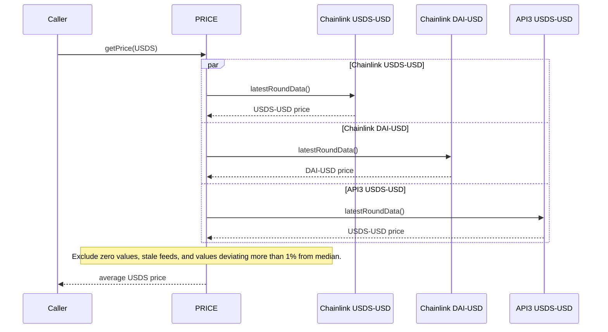
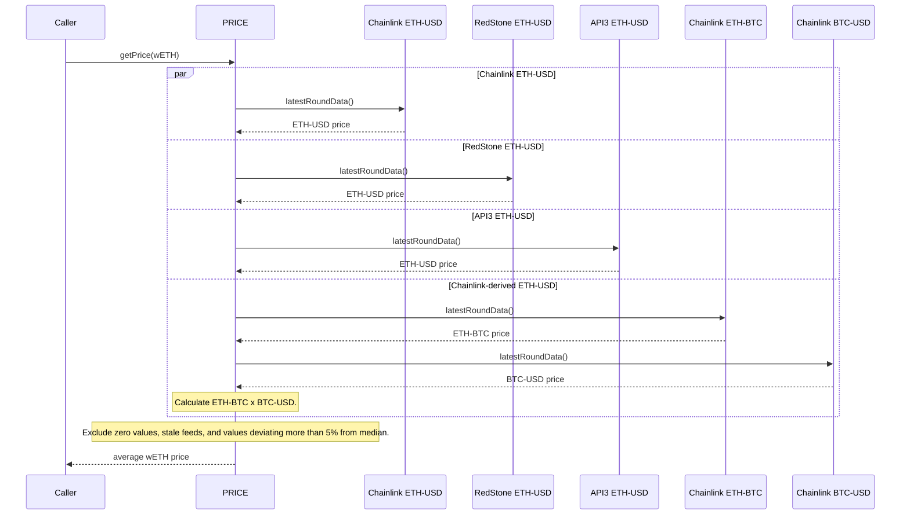
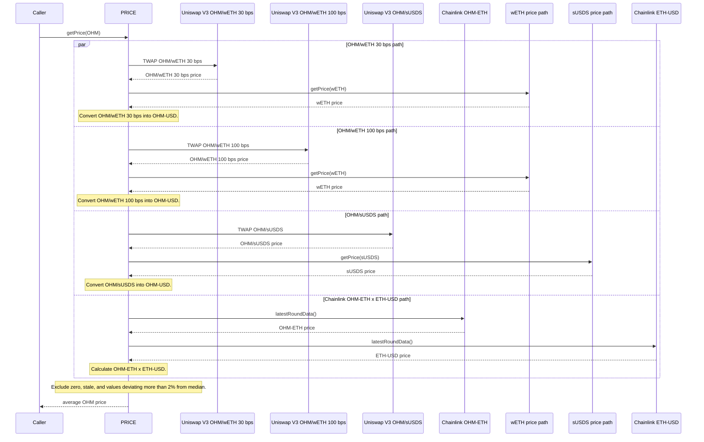

# Asset Configuration

PRICE v1.2 improves Olympus price resolution by combining oracle feeds from different providers where available and filtering out stale or deviating values. This increases resilience for protocol pricing while preserving backwards compatibility with the PRICE v1 functions used by existing policies.

Existing policies such as the Yield Repurchase Facility and Emissions Manager continue to read OHM prices through the v1-style functions they already use. Newer integrations can use asset-specific functions such as `getPrice(address asset_)`, `getPriceIn(address asset_, address quote_)`, and `getAssets()` to read configured asset prices directly.

External integrations that need standard oracle interfaces can consume configured PRICE v1.2 asset prices through [oracle adapters](./10_oracle-adapters.md) backed by `PriceCache`.

## Policy Usage

| Policy                    | PRICE usage                                                                                                      |
| ------------------------- | ---------------------------------------------------------------------------------------------------------------- |
| Yield Repurchase Facility | Uses backwards-compatible OHM price reads to size OHM buyback markets against USDS.                              |
| Emissions Manager         | Uses backwards-compatible OHM price reads to calculate premium and set minimum auction prices for OHM emissions. |
| Heart                     | Calls the policies that consume PRICE during regular protocol beats.                                             |

## Configured Assets

| Asset | Role in PRICE                                              | Price resolution                                                                                                                              | Moving average                                              |
| ----- | ---------------------------------------------------------- | --------------------------------------------------------------------------------------------------------------------------------------------- | ----------------------------------------------------------- |
| USDS  | Stable reserve reference asset                             | Average of Chainlink USDS-USD, Chainlink DAI-USD, and API3 USDS-USD after excluding deviating feeds.                                          | Not stored or used                                          |
| sUSDS | Yield-bearing reserve asset                                | ERC4626-derived price from USDS.                                                                                                              | Not stored or used                                          |
| wETH  | ETH reference asset used by OHM price paths                | Average of Chainlink ETH-USD, RedStone ETH-USD, API3 ETH-USD, and a Chainlink ETH-BTC x BTC-USD derived path after excluding deviating feeds. | Not stored or used                                          |
| OHM   | Protocol token priced for YRF, EM, and future integrations | Average of two OHM/wETH Uniswap V3 fee-tier feeds, OHM/sUSDS, and Chainlink OHM-ETH x ETH-USD after excluding deviating feeds.                | Stored for 30 days, but not used as an OHM spot-price input |

## Configuration Values

| Asset | Strategy                               | Deviation threshold | Strict mode | Expected price            | Expected tolerance |
| ----- | -------------------------------------- | ------------------- | ----------- | ------------------------- | ------------------ |
| USDS  | `getAveragePriceExcludingDeviations()` | 100 bps             | Yes         | `1e18`                    | 100 bps            |
| sUSDS | ERC4626-derived from USDS              | N/A                 | N/A         | `1.095038992740982406e18` | 100 bps            |
| wETH  | `getAveragePriceExcludingDeviations()` | 500 bps             | Yes         | `2282.17e18`              | 500 bps            |
| OHM   | `getAveragePriceExcludingDeviations()` | 200 bps             | Yes         | `16.5e18`                 | 500 bps            |

## Feed Parameters

| Asset | Feed path                   | Stale threshold | TWAP window   |
| ----- | --------------------------- | --------------- | ------------- |
| USDS  | Chainlink USDS-USD          | 86,400 seconds  | N/A           |
| USDS  | Chainlink DAI-USD           | 86,400 seconds  | N/A           |
| USDS  | API3 USDS-USD               | 90,000 seconds  | N/A           |
| sUSDS | ERC4626 derived from USDS   | N/A             | N/A           |
| wETH  | Chainlink ETH-USD           | 3,600 seconds   | N/A           |
| wETH  | RedStone ETH-USD            | 86,400 seconds  | N/A           |
| wETH  | API3 ETH-USD                | 90,000 seconds  | N/A           |
| wETH  | Chainlink ETH-BTC leg       | 86,400 seconds  | N/A           |
| wETH  | Chainlink BTC-USD leg       | 3,600 seconds   | N/A           |
| OHM   | Uniswap V3 OHM/wETH 30 bps  | N/A             | 1,500 seconds |
| OHM   | Uniswap V3 OHM/wETH 100 bps | N/A             | 1,500 seconds |
| OHM   | Uniswap V3 OHM/sUSDS        | N/A             | 1,500 seconds |
| OHM   | Chainlink OHM-ETH leg       | 86,400 seconds  | N/A           |
| OHM   | Chainlink ETH-USD leg       | 3,600 seconds   | N/A           |

## How Price Resolution Works

For assets with multiple feeds, PRICE asks each configured feed for a price, drops zero values and feeds outside the configured deviation threshold, then averages the remaining values. Strict mode requires enough surviving feeds to calculate a resilient average. For OHM, the two OHM/wETH pools are separate feed inputs that share the same wETH price path.

For Chainlink, RedStone, and API3 Chainlink-compatible paths, the stale threshold is the maximum time since the feed's last update. API3 feeds use a 90,000 second threshold, giving a one-hour grace period around their 24-hour heartbeat. For Uniswap V3 paths, the TWAP window defines the period used to smooth pool prices.

OHM's 30-day moving average is migrated into PRICE v1.2 for backwards-compatible target-price reads. It is not an input to OHM spot-price resolution.

PRICE audit references are listed on the [audits page](../security/02_audits.md#price-v12).

## USDS Price Resolution

## wETH Price Resolution

## OHM Price Resolution

## Configuration Changelog

| Date       | Released Version | Change                                                                                                                                                                                 |
| ---------- | ---------------- | -------------------------------------------------------------------------------------------------------------------------------------------------------------------------------------- |
| 2026-07-14 | PRICE v1.2       | Released asset configuration from olympus-v3 PR #187 head `a7402cac180f9250225e154e4b4ca9b7a23e06f4`. Configures resilient multi-feed price resolution for USDS, sUSDS, wETH, and OHM. |
