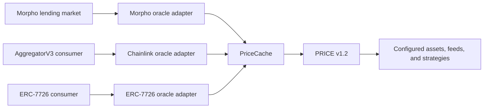
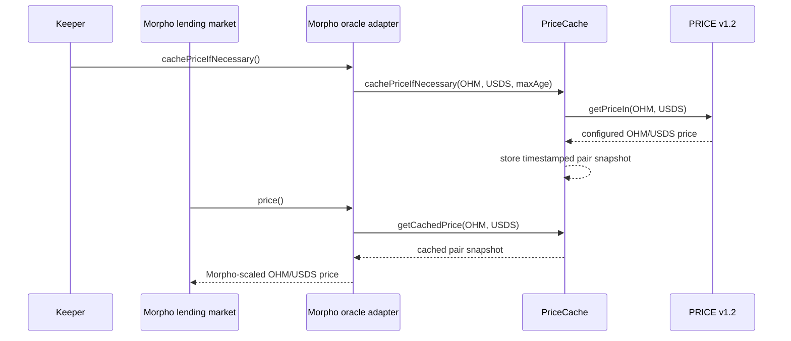

# Oracle Adapters

PRICE v1.2 has two consumption paths. Protocol policies and newer integrations can read the module directly through functions such as `getPrice()` and `getPriceIn()`. Integrations that already expect a standard oracle interface can use adapter contracts instead.

The adapters do not add independent price sources. PRICE v1.2 remains the price-resolution system: it resolves configured asset prices from the feeds, strategies, stale-feed checks, and deviation filters described in [Asset Configuration](./09_asset-configuration.md). `PriceCache` and the adapters then expose those configured prices in the format an external integration expects.

## Adapter Model

| Component                | Role                                                                                                             |
| ------------------------ | ---------------------------------------------------------------------------------------------------------------- |
| `PRICE` module           | Resolves configured asset prices using PRICE v1.2 feed and strategy configuration.                               |
| `PriceCache` policy      | Caches explicit asset/quote pair snapshots derived from PRICE v1.2.                                              |
| Chainlink oracle adapter | Exposes cached pair snapshots through a Chainlink-compatible `latestRoundData()` interface.                      |
| Morpho oracle adapter    | Exposes cached collateral/loan prices through Morpho's `IOracle.price()` interface.                              |
| ERC-7726 oracle adapter  | Exposes cached pair quotes through ERC-7726 quote semantics for integrations that consume that oracle interface. |
| Oracle factories         | Deploy adapter clones and manage whether creation and individual oracle instances are enabled.                   |

## PriceCache

`PriceCache` sits between PRICE v1.2 and the adapter contracts. It reads configured asset prices from PRICE v1.2, stores an asset/quote snapshot with a timestamp, and lets adapters serve that cached pair through the interface their consumer expects.

Cache refresh is permissionless for valid configured pairs. A caller can refresh a pair with `cachePrice()` or use `cachePriceIfNecessary()` to refresh only when the cached snapshot is older than the requested maximum age. Adapter clones also expose cache helper functions, so keepers and integrations can refresh a pair without calling `PriceCache` directly.

This keeps the integration surface small. Consumers need to understand the pair they are reading, the adapter interface, and the freshness requirement for their market or application. They do not need to know the full PRICE v1.2 strategy graph.

## Oracle Factories

Each adapter type has a factory that deploys new oracle clones for that interface. The factories track which clones they created, whether each clone is enabled, and which `PriceCache` policy the clone should use.

Chainlink and Morpho adapter clones are deployed for a specific token pair and `maxAge`. For example, a Morpho oracle can be deployed for an OHM collateral token and a USDS loan token. Those clone parameters are immutable: changing the pair or freshness window requires deploying a new oracle clone rather than editing the existing one.

ERC-7726 adapters are deployed by `maxAge` instead of by pair. The adapter can quote different base/quote pairs through the ERC-7726 interface, but the freshness window is still fixed for that clone.

`maxAge` is the maximum acceptable age, in seconds, for the cached pair snapshot used by an adapter. Adapter reads use it to decide whether cached data is fresh enough, and `cachePriceIfNecessary()` uses it to avoid unnecessary cache writes. A shorter `maxAge` gives consumers fresher data but requires more frequent cache refreshes. A longer `maxAge` reduces refresh pressure but allows older cached prices to remain usable.

Factories can also disable new oracle creation without disabling existing oracle reads. Separately, each deployed oracle clone can be disabled by its factory. A disabled oracle is still deployed, but adapter reads and cache helper calls treat it as unavailable.

The factory itself can also be disabled. When a factory is disabled, its managed oracle clones cannot use that factory for enabled context or cache refreshes. Consumers should treat oracles from a disabled factory the same way they treat individually disabled oracles: unavailable until the factory is re-enabled.

## Price Reads and Failure Behavior

| Adapter                  | Price read interface                                                                                                                                                                                                                                                                                                        | Freshness helpers                                            |
| ------------------------ | --------------------------------------------------------------------------------------------------------------------------------------------------------------------------------------------------------------------------------------------------------------------------------------------------------------------------- | ------------------------------------------------------------ |
| Chainlink oracle adapter | Chainlink-compatible reads through [`AggregatorV2V3Interface`](../contracts/02_docs/src/interfaces/AggregatorV2V3Interface.sol/interface.AggregatorV2V3Interface.md), with adapter metadata in [`IChainlinkOracle`](../contracts/02_docs/src/policies/interfaces/price/IChainlinkOracle.sol/interface.IChainlinkOracle.md). | `isStale()`, `cachePriceIfNecessary()`                       |
| Morpho oracle adapter    | Morpho [`IOracle.price()`](../contracts/02_docs/src/interfaces/morpho/IOracle.sol/interface.IOracle.md), extended by [`IMorphoOracle`](../contracts/02_docs/src/policies/interfaces/price/IMorphoOracle.sol/interface.IMorphoOracle.md).                                                                                    | `isStale()`, `cachePriceIfNecessary()`                       |
| ERC-7726 oracle adapter  | ERC-7726 quote reads through [`IPriceOracle.getQuote()` and `getQuotes()`](../contracts/02_docs/src/policies/interfaces/price/IPriceOracle.sol/interface.IPriceOracle.md), extended by [`IERC7726Oracle`](../contracts/02_docs/src/policies/interfaces/price/IERC7726Oracle.sol/interface.IERC7726Oracle.md).               | `isStale(base, quote)`, `cachePriceIfNecessary(base, quote)` |

Adapters read cached pair snapshots. They do not fall back to live PRICE resolution when the cached snapshot is missing or stale. If the last cached price is older than the adapter's `maxAge`, price reads revert with the adapter's stale-data error. Consumers can check staleness first, then refresh the cache and retry the read.

Cache refreshes can also fail if the underlying PRICE v1.2 configuration cannot produce a valid price. Examples include an asset that is not configured, an invalid pair, stale or deviating underlying feeds, an inactive API3 reader proxy, or a strategy that does not have enough valid inputs. In that case the cache is not updated; if the previous cached snapshot is now stale, the adapter remains unavailable until the PRICE configuration or underlying feeds can produce a fresh valid price.

## Morpho Lending Market Example

A Morpho lending market can use a Morpho oracle adapter to price OHM collateral against a loan asset such as USDS.

1. PRICE v1.2 resolves the configured OHM price and the configured USDS price.
2. `PriceCache` stores the OHM/USDS pair snapshot.
3. The Morpho oracle adapter reads the cached OHM/USDS snapshot.
4. The Morpho lending market calls `price()` on the adapter and receives the value in Morpho's expected scale.

If the cached snapshot is missing or stale for the adapter's configured freshness requirement, the adapter cannot provide a usable current price. Consumers should refresh the cache at the cadence required by the market or integration.

## Deployment Status

The oracle adapter contracts are documented from the PRICE v1.2 codebase, but their production addresses are pending. The contract address page uses zero address placeholders until deployment addresses are available.
